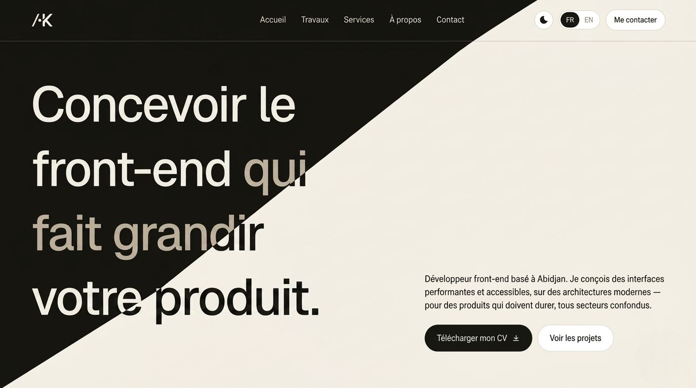

# Jean-Marc Koffi — Portfolio

Portfolio personnel présentant services, projets et compétences en développement front-end.

**Live**: [jmk-portfolio.vercel.app](https://jmk-portfolio.vercel.app)



## Caractéristiques

- **Bilingue** : Français/Anglais avec détection automatique via header `Accept-Language`
- **Dark mode** : Basculement automatique et manuel
- **Animations fluides** : GSAP, Framer Motion, Lenis (smooth scroll)
- **SEO optimisé** : Métadonnées, schema.org, sitemap, robots.txt
- **Analytics** : Vercel Analytics pour suivi des performances
- **Responsive** : Mobile-first avec Tailwind CSS
- **Accessibilité** : WCAG compliant

## Sections

- **Hero** : Présentation personnelle
- **Stack** : Technologies maîtrisées
- **Services** : Services proposés
- **Projets** : Portfolio de travaux
- **À propos** : Parcours et background
- **Contact** : Formulaire de contact

## Tech Stack

| Catégorie  | Technologies                        |
| ---------- | ----------------------------------- |
| Framework  | Next.js 14, React 19                |
| Langage    | TypeScript                          |
| Styles     | Tailwind CSS, PostCSS               |
| Animations | GSAP, Framer Motion, Lenis          |
| UI         | Radix UI, Lucide React, React Icons |
| Thème      | next-themes                         |
| Analytics  | Vercel Analytics                    |
| Hosting    | Vercel                              |

## Installation

```bash
# Cloner le repo
git clone https://github.com/Jean-Marc18/jm-portfolio.git
cd jm-portfolio

# Installer les dépendances
npm install

# Lancer le dev server
npm run dev

# Build de production
npm run build
npm start

# Linter
npm run lint
```

Accès: http://localhost:3000

## Structure du projet

```
.
├── app/                    # Routes et layouts Next.js
│   ├── (i18n)/            # Routes i18n
│   ├── layout.tsx         # Layout racine
│   ├── page.tsx           # Accueil
│   └── ...pages           # Projets, services, contact, etc.
├── components/            # Composants réutilisables
│   ├── layout/            # Sections principales (Hero, Header, Footer)
│   ├── common/            # Animations, observateurs
│   └── ui/                # Composants UI (boutons, cartes, etc.)
├── lib/                   # Utilitaires
│   └── i18n/             # Configuration i18n et dictionnaires
├── constants/             # Configurations globales
├── public/                # Ressources statiques
├── tailwind.config.ts     # Configuration Tailwind
└── next.config.mjs        # Configuration Next.js
```

## Configuration i18n

Langues supportées: `fr`, `en` (défaut: `fr`)

La locale est détectée par priorité:

1. Cookie `jmk-locale` (préférence utilisateur)
2. Header HTTP `Accept-Language`
3. Locale par défaut (`fr`)

## Performance

- **Core Web Vitals** : LCP, FID, CLS optimisés
- **Images** : Optimisation Vercel
- **Font** : Google Fonts avec `swap` et subsets
- **Smooth scroll** : Lenis pour expérience fluide

## Accessibilité

- WCAG 2.1 AA compliant
- Gestion du focus keyboard
- Contrast suffisant (light/dark)
- ARIA labels où nécessaire
- Schema.org structured data

## Licence

Droits d'auteur © 2025 Jean-Marc Koffi. Tous droits réservés.

## Contact

- 📧 Email: [jeanmarc.dev.18@gmail.com](mailto:jeanmarc.dev.18@gmail.com)
- 🔗 LinkedIn: [jean-marc-koffi](https://www.linkedin.com/in/jean-marc-koffi/)
- 💻 GitHub: [@Jean-Marc18](https://github.com/Jean-Marc18)
