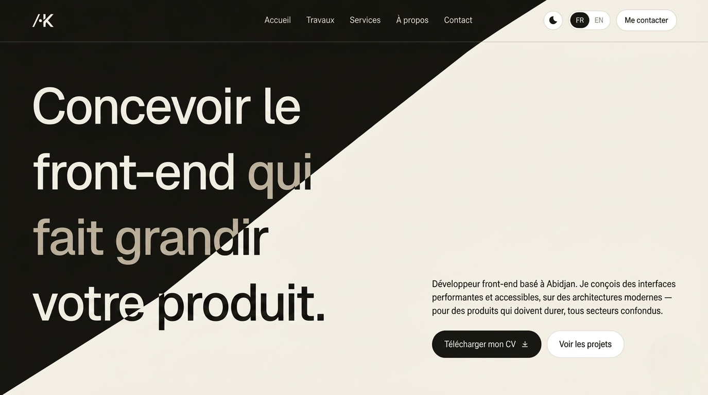

# Jean-Marc Koffi · Portfolio

Portfolio personnel présentant services, projets et compétences en développement front-end.

**Live**: [jmk-portfolio.vercel.app](https://jmk-portfolio.vercel.app)



## Caractéristiques

- **Bilingue** : Français/Anglais, détection automatique via `Accept-Language` puis cookie de préférence
- **Dark mode** : basculement manuel via `next-themes` (attribut `data-theme`)
- **Animations fluides** : GSAP + ScrollTrigger + SplitText, Lenis pour le smooth scroll
- **Contenu géré dans Sanity** : les projets se modifient dans un Studio séparé, sans toucher au code
- **Formulaire de contact** : Resend + React Email (template HTML responsive)
- **SEO** : metadata Next.js, JSON-LD (`Person`, `WebSite`, `ProfilePage`), sitemap, robots
- **Accessibilité** : WCAG 2.1 AA, skip link, `aria-expanded`/`aria-controls`, focus visible, `inert` sur les overlays
- **Performance** : Lighthouse **95+/100** en production (Core Web Vitals au vert)

## Sections

- **Hero** : accroche + CV téléchargeable
- **Stack** : technologies maîtrisées
- **Services** : offre détaillée
- **Projets** : case studies avec covers parallax
- **À propos** : parcours et méthode
- **Contact** : formulaire Resend + liens directs

## Tech Stack

| Catégorie  | Technologies                              |
| ---------- | ----------------------------------------- |
| Framework  | Next.js 16 (App Router, Turbopack)        |
| UI         | React 19, TypeScript 5                    |
| Styles     | Tailwind CSS 3, CSS personnalisé          |
| Animations | GSAP 3 (`@gsap/react`), Lenis             |
| CMS        | Sanity (Studio standalone, next-sanity)   |
| Email      | Resend + React Email                      |
| Thème      | next-themes                               |
| Analytics  | Vercel Analytics                          |
| Hosting    | Vercel                                    |

## Installation

Le dépôt contient deux applications indépendantes :

- `web/` : le site Next.js
- `studio/` : le Sanity Studio (projet `ibpq0dxr`, dataset `production`)

```bash
git clone https://github.com/Jean-Marc18/jm-portfolio.git
cd jm-portfolio
npm run install:all
npm run dev          # site sur http://localhost:3000
npm run dev:studio   # Studio sur http://localhost:3333
```

### Scripts disponibles

À la racine :

| Script                 | Description                                        |
| ---------------------- | -------------------------------------------------- |
| `npm run install:all`  | Installe les dépendances de `web` et `studio`      |
| `npm run dev`          | Lance le site (Next.js + Turbopack)                |
| `npm run dev:studio`   | Lance le Studio Sanity                             |
| `npm run build`        | Build de production du site                        |
| `npm run build:studio` | Build du Studio                                    |
| `npm run typegen`      | Régénère `web/sanity.types.ts` depuis le schéma    |

Dans `web/` : `npm run lint`, et `npm run email` pour prévisualiser les templates React Email (port 3001).

Dans `studio/` : `npm run deploy` publie le Studio sur `*.sanity.studio`, `npm run import-projects` et `npm run import-content` importent le contenu actuel dans Sanity.

### Variables d'environnement

Copie `web/.env.example` vers `web/.env.local` :

```env
NEXT_PUBLIC_SANITY_PROJECT_ID=ibpq0dxr
NEXT_PUBLIC_SANITY_DATASET=production
SANITY_REVALIDATE_SECRET=un-secret-long-et-aleatoire
RESEND_API_KEY=re_xxxxxxxxxxxxxxxx
```

Sans clé Resend, le formulaire renverra une 500 mais le site reste fonctionnel.

## Gérer le contenu avec Sanity

Le Studio est en ligne sur <https://jmk-portfolio.sanity.studio>. Tout le texte bilingue s'y saisit en français et en anglais.

| Dans le Studio         | Où ça s'affiche                                                                 |
| ---------------------- | ------------------------------------------------------------------------------- |
| Réglages du site       | Disponibilité, email, réseaux, localisation, langues, CV, chiffres clés, stack de l'accueil, SEO |
| Projets                | Accueil, page Travaux, études de cas                                            |
| Expériences            | Bandeau « Dernier poste », section À propos de l'accueil, page À propos         |
| Services               | Accueil (résumé, 3 premiers tags) et page Services (description, livrables)     |
| Questions fréquentes   | Page Services                                                                   |
| Stack technique        | Page À propos                                                                   |

- **Mise en ligne** : le site relit Sanity au plus toutes les heures. Pour une mise à jour immédiate, le webhook de [Sanity Manage](https://www.sanity.io/manage/project/ibpq0dxr/api/webhooks) appelle `https://jmk-portfolio.vercel.app/api/revalidate` (méthode POST, même secret que `SANITY_REVALIDATE_SECRET`) avec le filtre `_type in ["project", "siteSettings", "experience", "service", "faq", "skillCategory"]`.
- **Repli** : champ par champ, tout ce qui est vide dans Sanity reprend la valeur définie dans `web/lib/content/defaults.ts` (tirée de `web/lib/i18n/dictionaries.ts`). Si Sanity ne répond pas, le site reste complet.
- **Nombre de projets** : laisse le champ vide dans les Réglages pour compter automatiquement les projets publiés.
- **Import initial** : dans `studio/`, `npm run import-projects` puis `npm run import-content`. Les deux scripts n'écrasent jamais un contenu existant.
- **Schéma** : après une modification dans `studio/schemaTypes`, lance `npm run typegen` puis `npx sanity schemas deploy` dans `studio/`.

## Structure du projet

```
.
├── studio/                 # Sanity Studio standalone
│   ├── schemaTypes/        # Modèle de contenu
│   ├── structure.ts        # Menu du Studio (Réglages en singleton)
│   ├── scripts/            # Import du contenu existant
│   └── sanity.cli.ts       # Projet, dataset, TypeGen
└── web/                    # Site Next.js
    ├── app/                    # Routes et layouts Next.js (App Router)
    │   ├── api/contact/        # Endpoint POST pour le formulaire
    │   ├── api/revalidate/     # Webhook Sanity, rafraîchit les projets
    │   ├── layout.tsx          # Layout racine, metadata, JSON-LD, preloader gate
    │   ├── page.tsx            # Accueil
    │   └── ...                 # /travaux, /services, /a-propos, /contact, /projets/[slug]
    ├── components/
    │   ├── layout/             # Header, Footer, Hero, sections par page
    │   ├── common/             # Preloader, SmoothScroll, RevealObserver, PageTransition
    │   └── ui/                 # Primitives (Button, Card, Pill, Logo, icons, etc.)
    ├── emails/                 # Templates React Email (ContactEmail.tsx)
    ├── lib/
    │   ├── animations/         # Cover coordinator, useSplitIntro, useCountUp
    │   ├── i18n/               # Dictionnaires FR/EN + LanguageContext + config
    │   ├── content/            # Réglages, expériences, services, FAQ, stack (Sanity + repli)
    │   ├── projects/           # Projets Sanity, repli sur les dictionnaires
    │   └── gsap.ts             # Plugins GSAP + tokens d'easing/durée
    ├── constants/              # Routes, NAV_ORDER, métadonnées projets
    ├── sanity/                 # Client, requêtes GROQ, URL des images
    ├── sanity.types.ts         # Types générés par TypeGen
    └── public/                 # Fonts (Labil Grotesk), photos, CV PDF
```

## Configuration i18n

Langues supportées : `fr`, `en` (défaut : `fr`).

Détection par priorité côté serveur (Server Component) :

1. Cookie `jmk-locale` (préférence explicite)
2. Header HTTP `Accept-Language`
3. Locale par défaut (`fr`)

La locale détectée est passée en prop à un `LanguageProvider` client, ce qui élimine tout mismatch d'hydration.

## Décisions techniques

Quelques choix qui sortent du template Next.js générique :

- **Cover coordinator** ([lib/animations/cover.ts](./web/lib/animations/cover.ts)) : un module-level store qui permet au Preloader de "réserver" un délai *avant le mount React*, pour que les intros SplitText des heros attendent que l'overlay soit dégagé. Sans ça, les animations partent sous le preloader et l'utilisateur ne les voit pas.

- **Preloader sans flash** ([app/layout.tsx](./web/app/layout.tsx)) : un script inline dans `<head>` lit `sessionStorage` *avant* l'hydration et ajoute une classe sur `<html>` ; le CSS cache alors l'overlay instantanément pour les visites suivantes. Pattern inspiré de `next-themes`, évite l'effet "hero visible puis preloader par-dessus".

- **i18n SSR-compatible** ([app/layout.tsx](./web/app/layout.tsx)) : le layout est `async`, lit cookies + `Accept-Language` côté serveur et passe la locale au provider client en prop. Aucun localStorage côté client, aucun mismatch.

- **GSAP + Strict Mode** ([components/layout/header/Header.tsx](./web/components/layout/header/Header.tsx)) : la timeline du menu mobile est construite **une seule fois** en `paused: true` via `useGSAP`, puis pilotée par `play()` / `reverse()`. Évite les courses avec le revert de `useGSAP` lors des re-renders.

- **Skip link a11y** ([app/layout.tsx](./web/app/layout.tsx), [app/globals.css](./web/app/globals.css)) : caché visuellement, visible au `Tab`, saute directement à `<main id="main-content">`.

- **Email template aligné design system** ([emails/ContactEmail.tsx](./web/emails/ContactEmail.tsx)) : couleurs et typo du site (Geist via `@import` + fallbacks inline pour Outlook), SVG logo inline pour la compatibilité maximale (Apple Mail, Gmail, Outlook web).

## Performance

| Métrique | Cible   | Mesuré (prod) |
| -------- | ------- | ------------- |
| LCP      | < 2.5s  | ~1.2s         |
| CLS      | < 0.1   | 0.000         |
| TBT      | < 200ms | 0ms           |
| FCP      | < 1.8s  | ~0.7s         |

- Images via `next/image` avec `fill` + `sizes` responsive
- Fonts auto-hébergées (`next/font/google` + `@font-face` pour Labil Grotesk)
- Lenis synchronisé au ticker GSAP pour un seul RAF
- Aucune dépendance lourde côté client (~150 KB gzippé)

## Accessibilité

- WCAG 2.1 AA, contraste 16:1 sur le texte principal
- Skip link bilingue en début de `<body>`
- `aria-expanded` + `aria-controls` sur le menu burger
- `inert` sur les overlays fermés (menu mobile, preloader)
- Hiérarchie de titres sans saut de niveau
- Focus visible préservé (outline accent)
- `prefers-reduced-motion` respecté (Preloader, Lenis, transitions menu)

## Licence

Droits d'auteur © 2026 Jean-Marc Koffi. Tous droits réservés.

## Contact

- 📧 Email : [jeanmarc.dev.18@gmail.com](mailto:jeanmarc.dev.18@gmail.com)
- 🔗 LinkedIn : [jean-marc-koffi](https://www.linkedin.com/in/jean-marc-koffi/)
- 💻 GitHub : [@Jean-Marc18](https://github.com/Jean-Marc18)
